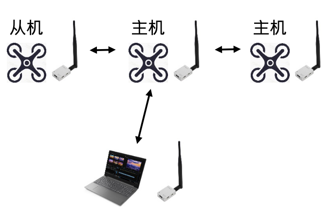
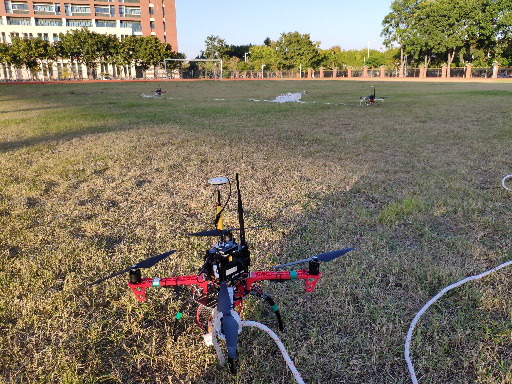

# 无人机数传通信代理 2.0

无人机之间通信通常依赖4G模块或者数传图传。4G模块需要购买SIM卡并长期续费，虽然带宽很高，但是在某些信号弱的地方就很不友好。该项目提供了地面站和多无人机之间利用数传电台通讯的ROS接口，地面站与无人机共享状态和位置信息，开发者无需思考串口通信的具体实现。该项目在**ubuntu 18.04**、**ros melodic**中充分测试，理论上在其他版本的系统中也能正确运行。


2.0版本与之前的版本完全不兼容，其底层结构完全不一样。新版本相比于旧版本接口更为清晰，功能更为强大，稳定性更好。使用**CUDA XBee Pro 数传电台** 测试发现单结点带宽最多只有5KB/s，这种状态下数传丢包率严重，伴随大量的ERROR输出。为了程序的正确运行，**务必保证单结点的带宽在2KB/s以下** （如果你的数传更为强劲，可以往上调整）。如果你希望将该项目迁移到您的编队项目中，**请务必保证通信过程中不出现任何ERROR输出**。ERROR的打印通常是带宽不足导致的，带宽不足致使缓冲区的旧数据被新数据覆盖，此时需要适当降低信息的发送频率。在默认配置下，**最多支持5台无人机的编队**。


*开发不易，请star支持一下*

<p style="text-align: center;">


<p style="text-align: center;">
  
  
<!-- <\p> -->


[【无人机通信】radio_proxy配置教程--地面站](https://www.bilibili.com/video/BV1X3411A7qd?spm_id_from=333.999.0.0)

[【无人机通信】radio_proxy配置教程--A3](https://www.bilibili.com/video/BV1kT4y1z7K3?spm_id_from=333.999.0.0)

[【无人机通信】radio_proxy配置教程--N3](https://www.bilibili.com/video/BV1R54y1Z7KQ?spm_id_from=333.999.0.0)


## 1. 特点

- 支持N3、A3、PX4飞控，仅需要少量修改开箱即用；
- 默认大端通讯，自动检测环境大小端，可移植性强；
- 提供目标、轨迹、位置共享，全方位支持编队；
- 支持地面站为中心或无人机为中心的通信拓扑结构；

## 2. 固定串口ID （如果不需要请忽略）

将数传通过USB连接到地面站或者机载电脑上，然后参考[此处](https://blog.csdn.net/sunkman/article/details/118196128)固定串口ID。 开发包中的默认端口号为`/dev/usb_radio`。喜欢用`/dev/ttyUSB0`之类的端口可以修改对应launch文件。

## 3. 安装

假设各位已经配置好了无人机机载电脑的环境：

1. A3上配置 [Onboard-SDK-ROS](https://github.com/dji-sdk/Onboard-SDK-ROS) 最新版（大疆无人机，如M300 RTK）
2. N3上配置 [Onboard-SDK-ROS 3.8.1](https://github.com/dji-sdk/Onboard-SDK-ROS)（自制无人机或大疆无人机）
3. PX4上配置 [MAVROS](https://www.baidu.com/link?url=qdfDO4WCHD5HML_o9JCDw2jj6DeOOzgi33U-_QuquMKBr-95cWAkux4cs1_hgOdU&wd=&eqid=eebaf7200006f58b0000000362810e43) 最新版（自制飞机）

#### 依赖安装

```
sudo apt install ros-melodic-serial
```

#### 新建ROS工作区

```
// 新建终端
mkdir -p catkin_ws/src
cd catkin_ws
catkin_make
cd src
git clone https://github.com/Vinson-sheep/radio_proxy.git
```

#### 编译

由于需求不同，编译部分是按需编译。

**地面站：**

打开`~/.bashrc`文件，追加：

```
export swarm_num=5 # 无人机数目
export broadcast=true # 如果地面站为通信中心，则负责转发内容
```

**无人机：**

打开`~/.bashrc`文件，追加：

```
export vehicle_id=<无人机id> # 无人机ID，从1到swarm_num
export swarm_num=5 # 无人机数目，用于过滤信息
export broadcast=false # 如果该无人机为通信中心，则设置为true
# 话题前缀
export prefix=mavros # PX4
export prefix=dji_sdk # N3
export prefix=dji_osdk_ros # A3
```

(共同) 打开`radio_proxy`主目录下的`backup`文件夹，根据需求将里面的内容覆盖`radio_proxy`根目录下`CMakeLists.txt`和`src`目录下的`AIR_proxy_node.cpp`。其中，GS表示`Ground Station`。回到`catkin_ws`目录下，使用`catkin_make`编译即可。

## 4. 运行

新建一个终端：

**地面站：**

```
roslaunch radio_proxy GS_proxy.launch
```

**无人机：**

```
roslaunch radio_proxy AIR_proxy.launch
```

尝试打印`topic`观察数据是否正常。

## 5. 问题

1. **2.x.x**版本均提供相同的接口，且本项目长期处于活跃状态，如果发现通信双方异常则可以重新Pull一下代码；
2. 高速集群编队需要高刷新率的信息共享，此时可以适当调节`uav_proxy.cpp`中`resendFlightDataTimer`和`resendStatusTimer`的回传频率（保证单结点的单宽小于2KB/s）；


